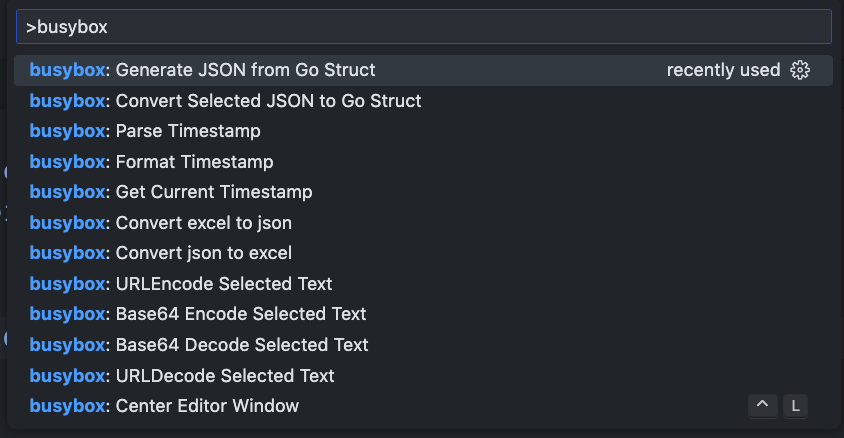
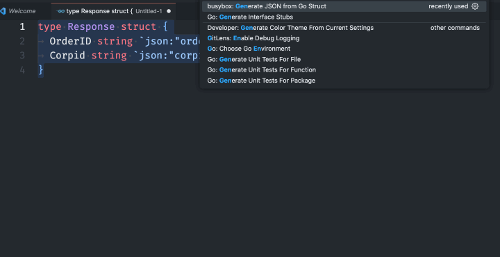

# busybox README

**Toolkits for VSCode**

I think there is no need to open too many tabs of JSON online toolkits. 

This project is to collect and bring them to VSCode.

## Features
type `ctrl+p` (or `cmd+p` in macos) to open command pallate,
input `busybox` to show all related command.

- Convert json to go struct

- Generate json from go struct, put result to clipboard.

- Encode / Decode base64 text
- Get Current Timestamp, format timestamp to ISOString, parse Datetime string to Timestamp
- url encode/decode
- center editor window like emacs use `ctrl+L`
- Conversion for json and excel

## TODO

- http request client

**Contributing**

Contributions are welcome. To test and run this extension, please refer to [vscode](https://github.com/microsoft/vscode) extension developing docs.

Feel free to submit issues or feature requests on [github](https://github.com/n-wen/busybox).

## **License**

Licensed under the MIT license.

