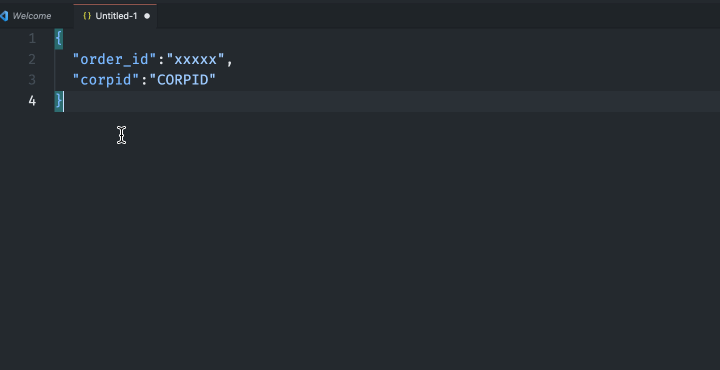

# busybox README

**Toolkits for VSCode**

[中文文档](./README_CN.md)

I think there is no need to open too many tabs of JSON online toolkits. 

This project aims to collect these tools and bring them to VSCode (now with others, like cursor, trace, etc.).

## Features
type `ctrl+p` (or `cmd+p` in macos) to open command pallate,
input `busybox` to show all related command.


## GNU Global (gtags) Support

Integrated [GNU Global](https://www.gnu.org/software/global/) code navigation for fast symbol jumping and reference finding in C/C++ and other languages.

### Features

- **Go to Definition** (`F12` / `Ctrl+Click`) - Jump to symbol definition
- **Find All References** (`Shift+F12`) - Find all references
- **Document Symbols** (`Ctrl+Shift+O`) - Show symbol list in current file
- **Smart Jump** - `Ctrl+Click` on definition to jump to references (requires `alternativeDefinitionCommand` config)

### Usage

1. Install [GNU Global](https://www.gnu.org/software/global/)
2. **Enable the feature** in VSCode settings:
   ```json
   {
     "busybox.gnuGlobal.enabled": true
   }
   ```
3. **Reload VSCode** to activate the feature
4. Run command `busybox: Create GNU Global Database` to create database (stored in `.vscode` directory)
5. Use `F12` to go to definition, `Shift+F12` to find references

### Recommended Configuration

Add the following configuration in VSCode settings to enable jumping to references when `Ctrl+Click` on definition:

```json
{
  "busybox.gnuGlobal.enabled": true,
  "editor.gotoLocation.alternativeDefinitionCommand": "editor.action.goToReferences"
}
```

### Commands

| Command | Description |
|---------|-------------|
| `busybox: Create GNU Global Database` | Create gtags database |
| `busybox: Update GNU Global Tags` | Update gtags database |
| `busybox: Find Symbol Definition (GNU Global)` | Find symbol definition |
| `busybox: Find Symbol References (GNU Global)` | Find symbol references |

---

## Other Features

- Convert json to go struct



- Generate json from go struct, put result to clipboard.


- Encode / Decode base64 text
- Get Current Timestamp, format timestamp to ISOString, parse Datetime string to Timestamp
- url encode/decode
- center editor window like emacs use `ctrl+L`
- Conversion for json and excel
- Open file in your idea
If idea64.exe not in your path, consider add following configuration:
```json
{
  "busybox.idea.cmd.path": "idea"
}
```

## TODO

- http request client

**Contributing**

Contributions are welcome. To test and run this extension, please refer to [vscode](https://github.com/microsoft/vscode) extension developing docs.

Feel free to submit issues or feature requests on [github](https://github.com/n-wen/busybox).

## **License**

Licensed under the MIT license.

