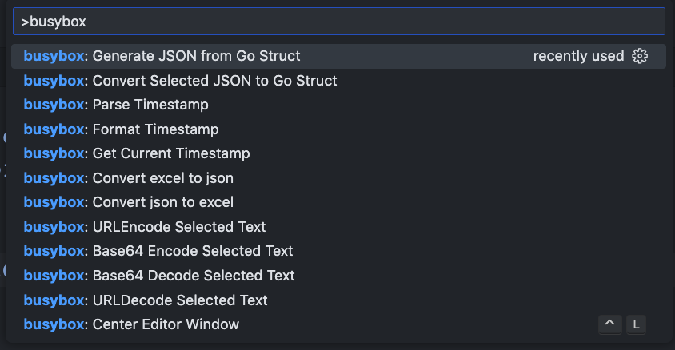
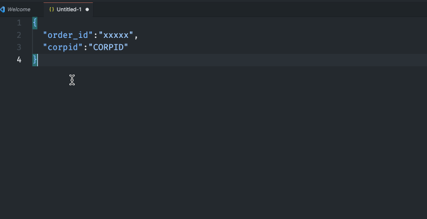
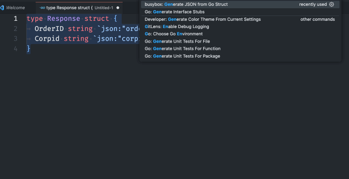

# busybox 说明文档

**VSCode 工具箱**

[English](./README.md)

不需要打开太多 JSON 在线工具的标签页了。

本项目旨在收集这些工具并将它们带到 VSCode（现在还支持 cursor、trace 等）。

## 功能
输入 `ctrl+p`（macOS 中为 `cmd+p`）打开命令面板，输入 `busybox` 显示所有相关命令。



## GNU Global (gtags) 支持

集成了 [GNU Global](https://www.gnu.org/software/global/) 代码导航功能，为 C/C++ 等语言提供快速的符号跳转和引用查找。

### 功能特性

- **跳转到定义** (`F12` / `Ctrl+Click`) - 跳转到符号定义
- **查找所有引用** (`Shift+F12`) - 查找所有引用
- **文档符号** (`Ctrl+Shift+O`) - 显示当前文件的符号列表
- **智能跳转** - 在定义处 `Ctrl+Click` 可跳转到引用（需配置 `alternativeDefinitionCommand`）

### 使用方法

1. 确保已安装 [GNU Global](https://www.gnu.org/software/global/)
2. **启用功能**，在 VSCode 设置中添加：
   ```json
   {
     "busybox.gnuGlobal.enabled": true
   }
   ```
3. **重新加载 VSCode** 以激活功能
4. 运行命令 `busybox: Create GNU Global Database` 创建数据库（存储在 `.vscode` 目录）
5. 使用 `F12` 跳转定义，`Shift+F12` 查找引用

### 推荐配置

在 VSCode 设置中添加以下配置，启用功能并实现在定义处 `Ctrl+Click` 跳转到引用：

```json
{
  "busybox.gnuGlobal.enabled": true,
  "editor.gotoLocation.alternativeDefinitionCommand": "editor.action.goToReferences"
}
```

### 相关命令

| 命令 | 描述 |
|------|------|
| `busybox: Create GNU Global Database` | 创建 gtags 数据库 |
| `busybox: Update GNU Global Tags` | 更新 gtags 数据库 |
| `busybox: Find Symbol Definition (GNU Global)` | 查找符号定义 |
| `busybox: Find Symbol References (GNU Global)` | 查找符号引用 |

### Maven 源码导航

支持跳转到 Maven 依赖的源码（例如 Spring Framework 源码）。

#### 设置步骤

1. 运行 `busybox: Download Maven Dependency Sources` 下载源码
2. 运行 `busybox: Extract Maven Sources to ~/.m2/sources` 解压 jar 文件
3. 运行 `busybox: Rebuild Library Gtags Database` 构建 gtags 索引

设置完成后，即可跳转到 Maven 依赖库的源码定义！

| 命令 | 描述 |
|------|------|
| `busybox: Download Maven Dependency Sources` | 运行 `mvn dependency:sources` |
| `busybox: Extract Maven Sources to ~/.m2/sources` | 解压所有 *-sources.jar |
| `busybox: Rebuild Library Gtags Database` | 为 ~/.m2/sources 构建 gtags |

---

## 其他功能

- JSON 转 Go 结构体



- Go 结构体生成 JSON，结果复制到剪贴板



- Base64 编码/解码
- 获取当前时间戳、格式化时间戳为 ISOString、解析日期时间字符串为时间戳
- URL 编码/解码
- 像 Emacs 一样使用 `ctrl+L` 居中编辑器窗口
- JSON 和 Excel 相互转换
- 在 IDEA 中打开文件

如果 idea64.exe 不在系统路径中，可以添加以下配置：
```json
{
  "busybox.idea.cmd.path": "idea"
}
```

## 待办

- HTTP 请求客户端

## 贡献

欢迎贡献代码。要测试和运行此扩展，请参阅 [vscode](https://github.com/microsoft/vscode) 扩展开发文档。

欢迎在 [github](https://github.com/n-wen/busybox) 上提交问题或功能请求。

## 许可证

基于 MIT 许可证。

